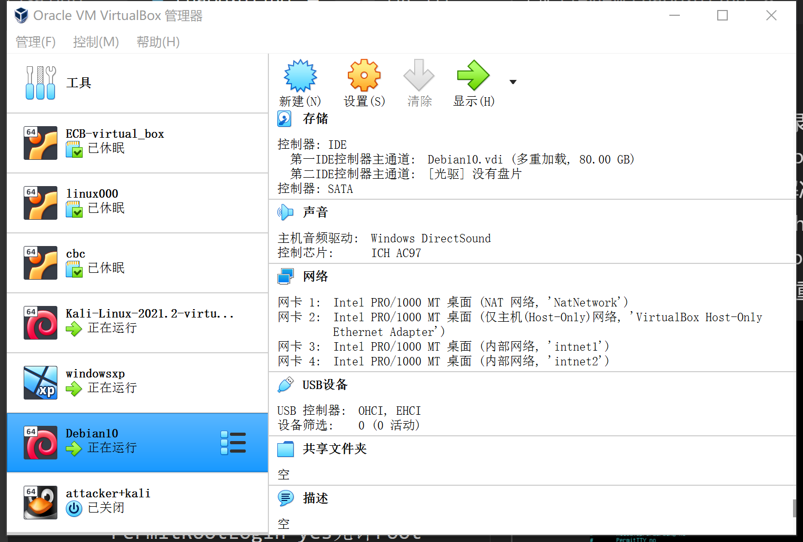
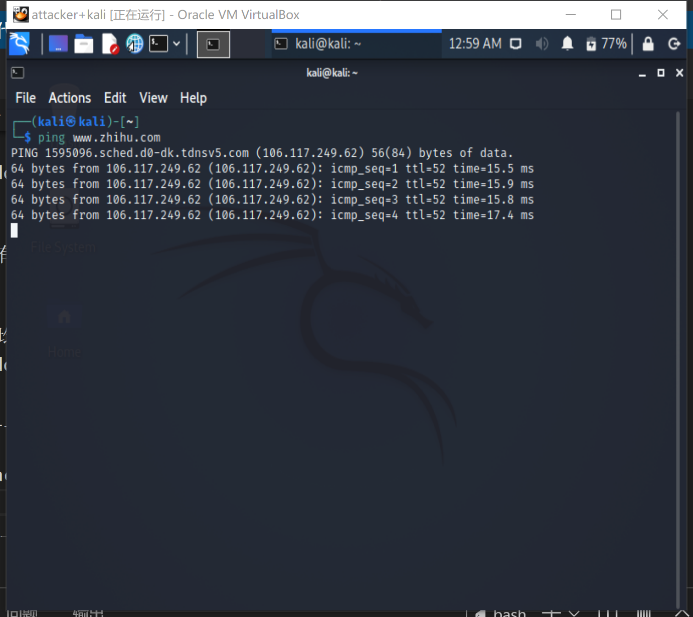

# 基于VirtualBox的网络攻防基础环境搭建
## 实验目的
- 掌握 VirtualBox 虚拟机的安装与使用

- 掌握 VirtualBox 的虚拟网络类型和按需配置

- 掌握 VirtualBox 的虚拟硬盘多重加载


## 实验环境
- vitualbox6.1
    + ***Attacker***     kali
    + ***Victim***     windowsxp&&kali
    +  ***Gateway***   debian10 buster

## 实验步骤

### 1.实验环境搭建
- 导入kali的ova，登录kali/kali 
- 导入windowxp的vdi,在管理->虚拟介质管理中在无挂载情况下切换为多重加载,设置PCnet-FAST III
- 下载debian10.vdi.tar.gz，解压得到vdi，切换到多重加载并挂载，如图配置四张网卡，root/toor登录




- 网关网卡地址

    + 网卡1 NAT网络
    + 网卡2 host-only
    + 网卡3 intnet1
    + 网卡4 intnet2

### 2.配置Debian的dncp文件
```
#vi gw-enp0s9.conf
interface=enp0s9
dhcp-range=172.16.111.100,172.16.111.150,240h

#vi gw-enp0s10.conf
interface=enp0s10
dhcp-range=172.16.222.100,172.16.222.150,240h
```

查看/etc/dnsmasq.conf文件，发现已配置好，最后重启服务并设置开机自启


### 3.intnet1
- windowsxp1(172.16.111.101)
    + 采用手动配置地址方法
    
    + ip config &&测试和网关的连通性。防火墙工作，只能实现单向通信；关闭防火墙，能实现双向通信
    

    

- kali1(172.16.111.111)
    + kali自动获取地址并成功联通xindowsxp
    

    + kali连通网关
    

- 通过dnsmasq查看log实现网关对Windowsxp的监控


### 4.intnet2
- WindowsXP2(172.16.222.109)
    + 设置intnet2以达到拔网线的效果，WindowsXP会自动被分配到新的地址
    
    + 连通性测试，与网关连通，与intnet1中的单位不连通
    
    
- kali2(172.16.222.111)
    + 查看IP地址
    

### 5.搭建攻击者环境
- attackerkali(10.0.2.4)
    + 查看IP
    


- 重启网关网卡
    ```
    ifdown enp0s3 && ifup enp0s3
    ```

### 6.实验要求-连通性测试

- 靶机可以直接访问攻击者主机
- 攻击者主机无法直接访问靶机

    + intnet2中WindowsXP与NAT网络中的网关（10.0.2.15）有连通性
    

    + intnet2中WindowsXP与网关NAT网络中的攻击者kali（10.0.2.4）有连通性
    
    
    ***Kali一直在ping，，导致网络不通的时候命令行没有回应***
    + 攻击者ping不通intnet1网关
    

    + 攻击者ping不通intnet2的WindowsXP
    
    


- 网关可以直接访问攻击者主机和靶机
    + attackerkali
    
    + windowsxp
    

- 靶机的所有对外上下行流量必须经过网关
    + 在debian中用tcpdump工具抓包，同时在intnet2中的WindowsXP上面打开网站产生流量
    
    

    + 抓包保存后传到宿主机，用wireshark打开，可以在纯净环境中观察到WindowsXP的上网过程。
    

- 所有节点均可以访问互联网
    + intnet1-windowsxp上网
    
    + intnet1-kali上网
    
    + intnet2-windowsxp上网
    
    + intnet2-kali上网
    
    + attacker+kali上网
    
    + 网关上网
    

## 实验问题解决
- 实现ssh远程登录Debian的时候报错permission denied 无法建立连接，解决的方法是修改/etc/ssh/sshd_config文件,PermitRootLogin yes允许root登录，最后重启


## 参考资料
- [Linux--vim操作命令（全）](https://blog.csdn.net/pansaky/article/details/83755750)
- [SSH连接报错:Permission denied, please try again.的解决方法](https://cloud.tencent.com/developer/article/1454777)
- [老师提供的硬盘](https://c4pr1c3.gitee.io/cuc-wiki/ns/2021/calendar.html)
- [课件](https://c4pr1c3.gitee.io/cuc-ns/chap0x01/exp.html)
- [视频](https://www.bilibili.com/video/BV1CL41147vX?p=12)

## 课后作业

### 以下⾏为分别破坏了CIA和AAA中哪⼀个属性或多个属性？
#### 1.	小明抄小强的作业
CIA：机密性；AAA：审计
#### 2. 小明把小强的系统折腾死机了
CIA：可用性
#### 3. 小明修改了小强的淘宝订单
CIA：完整性、机密性；AAA：认证、授权
#### 4. 小明冒充小强的信用卡账单签名
CIA：完整性；AAA：认证
#### 5.小明把自⼰电脑的IP修改为小强电脑的IP，导致小强的电脑⽆法上⽹
CIA：可用性；AAA：认证、授权、审计
