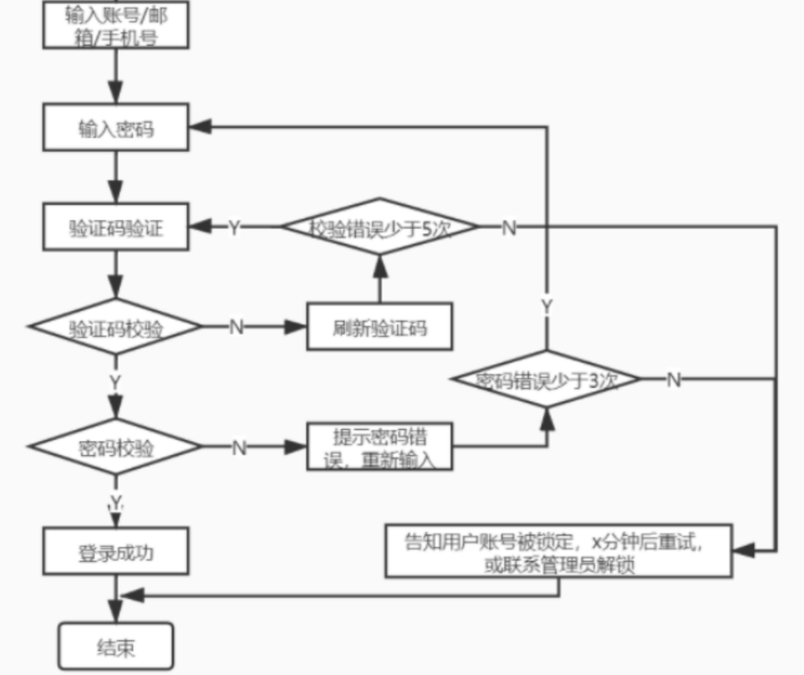

# 第二章 操作系统的访问控制设计实例研究
   ## 实验目的

+ 通过 iOS 和 Android 系统为研究对象，进行访问控制的理解和设计
## 实验环境

+ 操作系统版本：Android 10
+ 硬件设备型号：huawei reno7
+ 是否默认设置：是

## 实验结果验证

+ 当系统处于锁屏状态下接收到新短信时，不解锁情况下

  - 系统是否允许查看短信内容？

    默认设置是可以查看短信的前部分内容，但可以通过具体设置将内容隐藏，显示为“收到了x条短信”。

  - 系统是否允许回复短信？

    不允许。

  - 安卓上的 App : 以 **微信电话本** 为例，在接管了系统短信功能和权限之后，是否会有一些不同的功能设定？

    + 会显示需要修改手机默认设置，若使用系统自带，则仍然只可读而不可回复。

+ 当系统处于锁屏状态下，使用系统内置（例如 iOS 的 Siri ）或第三方的语音助手可以完成以下哪些操作？

  - **访问通讯录** 不可以

  - **拨打电话** 可以

  - **访问相册** 不可以

  - **查看短信收件箱** 不可以

    + 需解锁手机获得权限。

+ 如果你的手机支持指纹识别解锁手机，请实验并分析指纹识别相比较于简单密码、复杂密码、图形解锁、人脸识别解锁、声纹解锁等解锁方式的安全性、便利性差异。

  | 密码类型     | 安全性                                                   | 便利性                                               |
  | ------------ | -------------------------------------------------------- | ---------------------------------------------------- |
  | 简单密码     | 安全性低于指纹解锁，可被分析或统计破解                   | 易于记忆和解锁操作                                   |
  | 复杂密码     | 分析破解方面有一定难度，但不是最高               | 不易于记忆和解锁操作                           |
  | 图形解锁     | 忽略次数限制的条件下可能被穷举分析，安全性显著降低               | 同密码类似，也有复杂和简单的相对性                         |
  | 人脸识别解锁 | 人脸识别主要是特征识别，安全性在特征唯一的情况下可以保证 | 操作方便且不涉及到复杂的记忆，但对识别功能的准确性有要求，另外极易被其他人操纵解锁 |
  | 声纹解锁     | 易伪造，安全性较低                                                 | 需要说话，在安静的环境不方便                         |
  | 指纹解锁     | 指纹不容易出现重复，复制指纹不容易实现，安全性较好       | 操作便捷，但对识别功能的精准性捕捉有要求 |

+ 以上设计实现方式属于我们课堂上讲过的哪种强制访问控制模型？Lattice/BLP？Biba？

  Biba模型，可以上读下写，锁屏时只能读短信，属于**上读**；解开屏幕以后，可以回复短信，属于**下写**。

+ 系统或第三方应用程序是否提供了上述功能的访问控制规则修改？如果修改默认配置，是提高了安全性还是降低了安全性？

  是，例如上面的**微信电话本**，可以修改权限。降低了安全性，将权限放开，相当于脱离了操作系统的控制。

## 实验问题思考
- “找回口令功能”和“忘记密码”在访问授权机制中的意义？请尝试设计几种安全的“找回口令功能”，详细描述找回口令的用户具体操作过程。

    （身份）认证:认证的实现过程就是将主体（数字）身份标识唯一的绑定到（真实）主体的过程。

    身份认证是访问授权的基础，没有身份认证就无法实现访问授权。

    "找回口令功能”和“忘记密码"功能实际上就是主体需要向访问控制系统的身份认证模块证明“我就是”,被证明之后，授权其可以更改密码。

- 邮箱找回口令功能设计：

    1. 用户输入注册时要求他填写邮箱地址,如果地址错误，不给与提示。
    2. 如果用户输入的邮箱错误,发邮件给其注册填写的邮箱说明有人尝试重置密码的情况并告知IP，但是他输入的邮箱不在数据库里面。
    3. 为了防止机器人攻击,在提交表单之前加上CAPTCHA 识别。
    4. 用户使用邮件所发的验证码，进行口令重置。

- 绘制用户使用账号/口令+图片验证码方式登录系统的流程图。考虑认证成功和失败两种场景，考虑授权成功和失败两种场景。

    

- Windows XP / 7 中的访问控制策略有哪些？访问控制机制有哪些？

    **自主访问控制**：访问控制列表（Access Control List, ACL）
    
    所有用户或用户组的权限访问设置都会被存储下来，并允许随时被有权限进行修改的用户进行调整，如取消某个用户对某个资源的“写入”权限。  

    **强制访问控制：**“Administrators”组的全部成员都拥有“更改用户的权限”(Take Ownership)的权力。

    **基于角色的访问控制**：一个身份被分配给一个被授权的组。在访问控制列表中，每一个用户或用户组都对应一组访问控制项。

- 用权限三角形模型来理解并描述下 2 种威胁模型：提权、仿冒。

    **微软的STRIDE 模型**
    | 威胁     | 安全性属性 |
    |----------|------------|
    | 篡改     | 完整性     |
    | 否认     | 不可抵赖性 |
    | 信息泄露 | 机密性     |
    | 拒绝服务 | 可用性     |
    | 提升权限 | 授权       |

    **基于角色的访问控制模型:**

    * 提权：提权从目的可分为纵向提权与横向提权：
        1. 纵向提权：低权限角色获得高权限角色的权限。
        2. 横向提权：获得同级别角色的权限.

    * 仿冒：    A用户仿冒B用户，这样就得到了B用户的权限,B用户的权限,但没有改变B用户的权限。

- 试通过操作系统的访问控制机制来达到预防一种真实病毒的运行目的。

    对于一个系统服务，管理员正确配置其调用的可执行文件的读写权限使得低权限用户没有对其程序的写入权限。这样就可以避免这个程序被病毒替换成任意可执行程序。

- 什么是 OAuth？

    让用户告诉系统，同意第三方应用访问自己的一部分数据,系统从而产生一个令牌来认证与授权的一种协议。

- 什么是 OpenID？

    允许用户使用一个已经存在的帐号来登录多个网站，而不必创建新的密码。

- 试用本章所学理论分析 OAuth 和 OpenID 的区别与联系。

    oauth2用来授权，openid用来认证。openid提供对实体的鉴别，而OAuth有通用性。
    
    当一个服务向第三方服务发行一个令牌可以用来访问一个被保护资源的令牌时，只要拥有令牌就能够访问其被授予的资源。

- 如何使用 OAuth 和 OpenID 相关技术实现单点登录（Single Sign On）？

    1. 当用户第一次登录时，将用户名密码发送给用户服务。
    2. 验证用户将用户标识OpenId返回到客户端。
    3. 客户端进行存储。
    4. 访问子系统,将OpenId发送到子系统。
    5. 子系统将OpenId转发到验证服务。
    6. 验证服务将用户认证信息返回给子系统。
    7. 子系统构建用户验证信息后将授权后的内容返回给客户端。