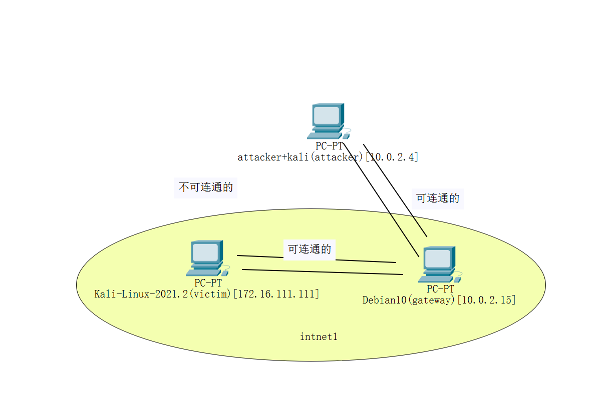
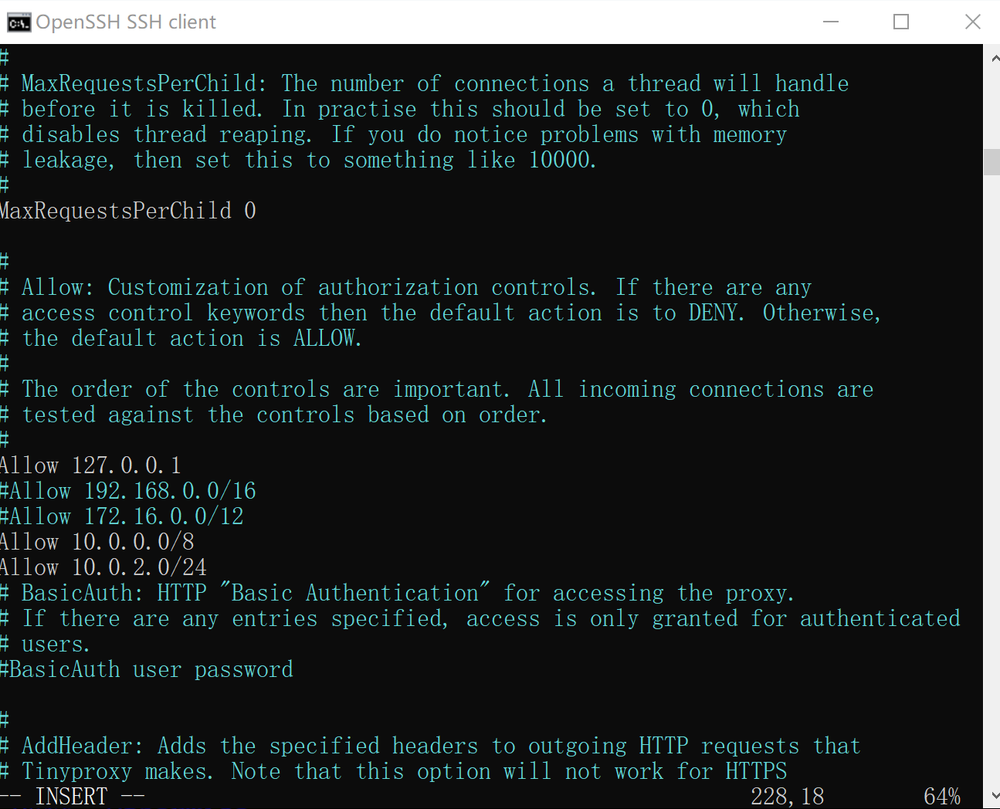
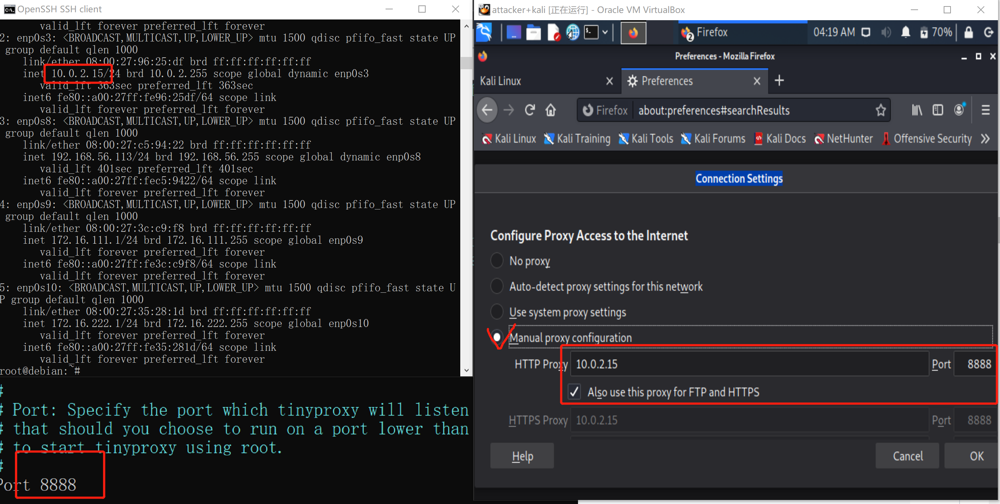
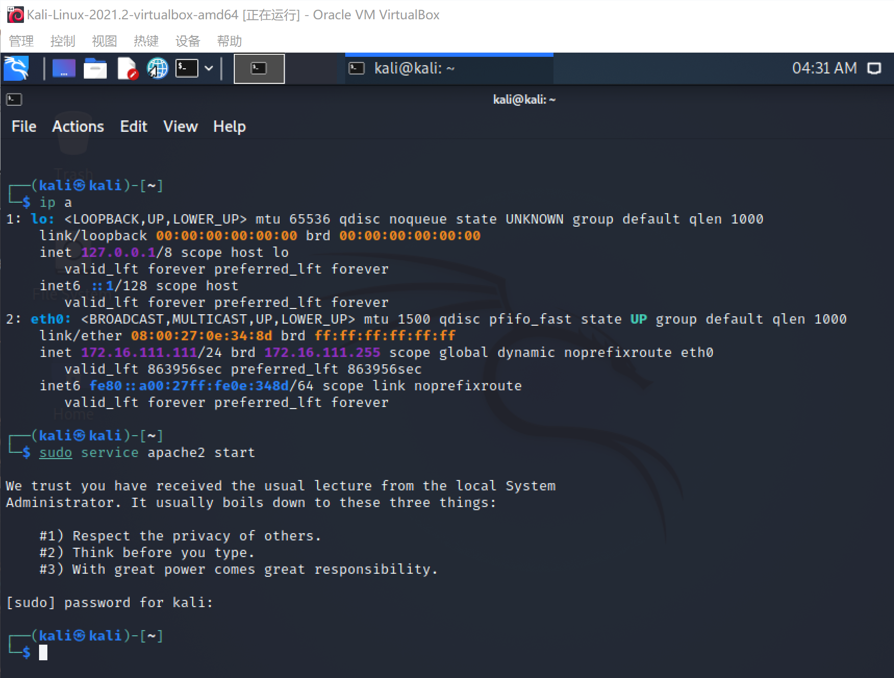
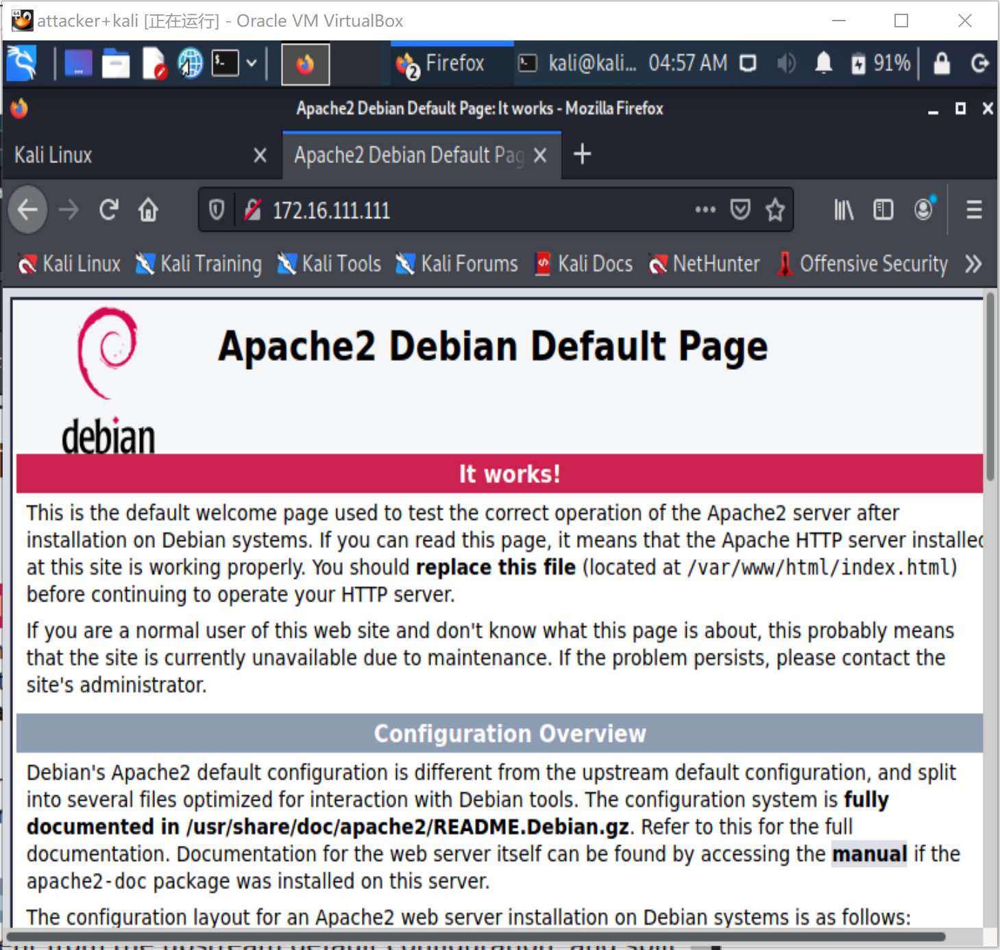
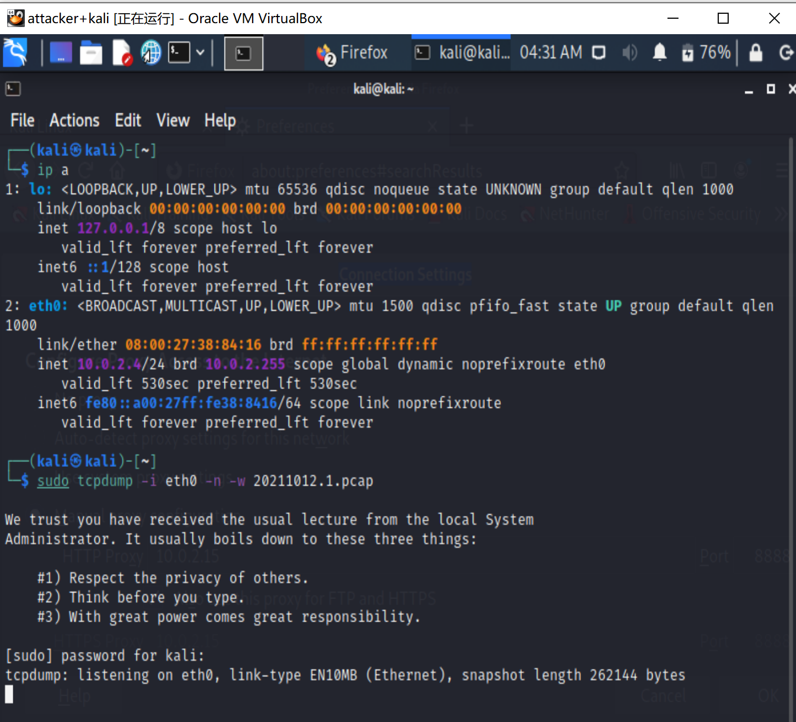
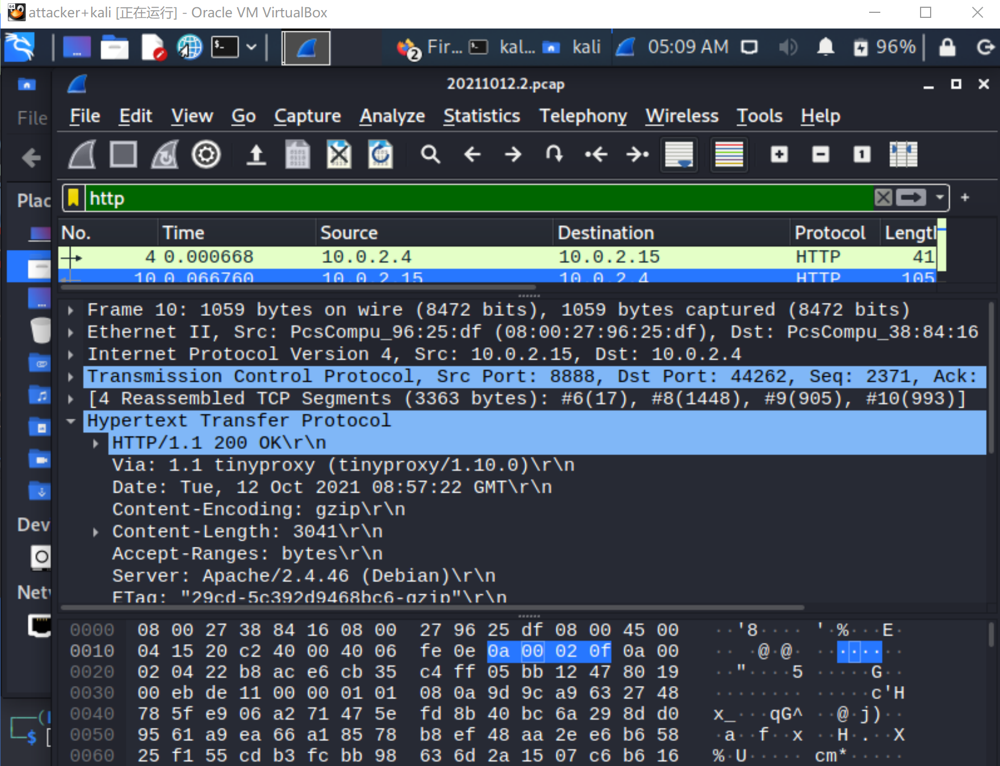
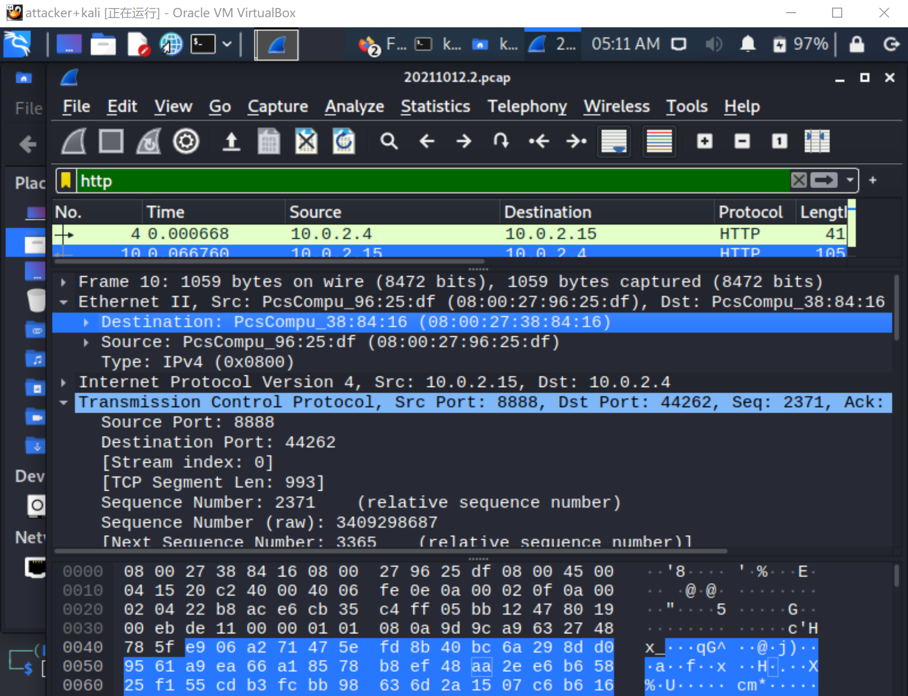
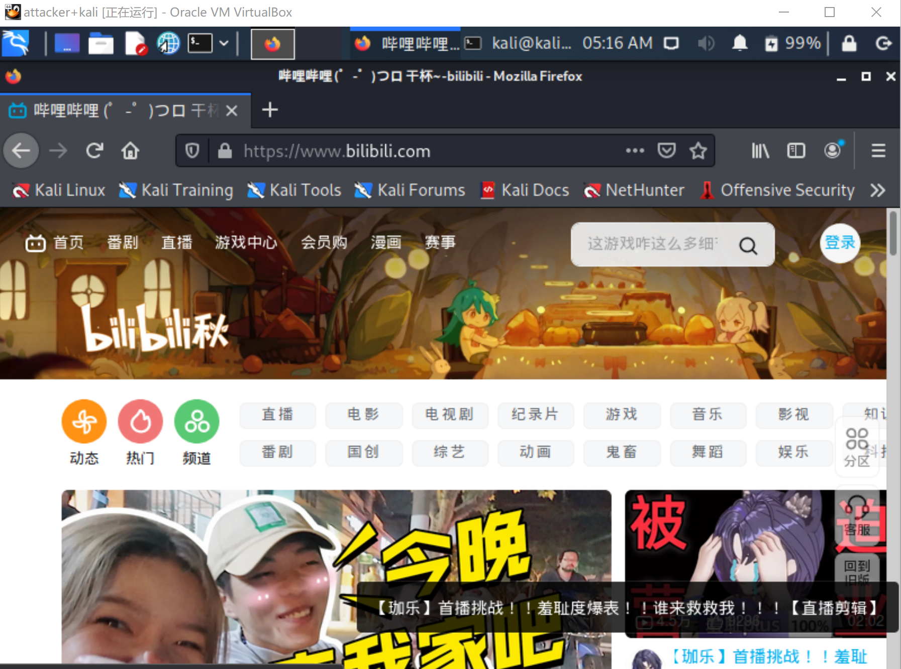
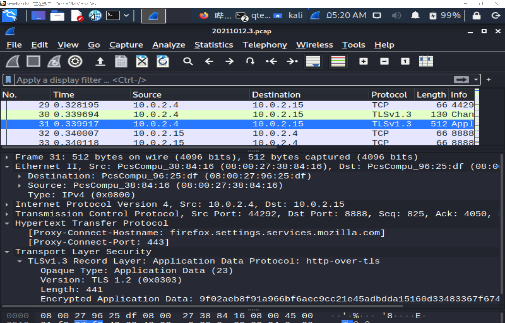

# HTTP代理服务器实验报告
## 实验环境
- `attacker` kali rolling
- `victim` kali rolling
- `gateway` debian
- 网络拓扑图

## 实验要求
- 在Kali Linux中安装tinyproxy，- 然后用主机设置浏览器代理指向tinyproxy建立的HTTP正向代理
- 在Kali中用wireshark抓包，分析抓包过程，理解HTTP正向代理HTTPS流量的特点
## 实验过程
### 1. 网关
```
# 下载tinyproxy
sudo apt-get update 
sudo apt-get install tinyproxy

# 编辑文件，更改Allow条件
sudo vim /etc/tinyproxy/tinyproxy.conf

# 开启tinyproxy服务
systemctl start tinyproxy
#重启tinyproxy服务
systemctl restart tinyproxy.service
#查看tinyproxy服务状态
systemctl status tinyproxy.service
```

### 2.攻击者kali
- 在浏览器中根据tinyproxy的配置修改connection settings

### 3.靶机kali
```
cd /var/www/html 
ls
#index.html  index.nginx-debian.html

sudo touch server.php 
sudo vim server.php  

php -S 0.0.0.0:8888
# 开启apache2服务
sudo service apache2 start
```

### 4.攻击者kali访问靶机，同时抓包
- 成功访问靶机

- 抓包操作

### 5.分析抓包过程


- `via: 1.1 tinyproxy`，说明tinyproxy代理服务器在工作时可以隐藏IP地址
### 5.通过代理服务器访问https站点，分析抓包过程


- `Encrypted Application Data:xxxxx`说明正在进行加密通信。代理服务器建立连接后与其进行了密钥的交换，生效后传输数据被加密。
## 参考资料
- [kali linux下的文件操作常用命令(kali文件操作基础学习 纯干货)](https://blog.csdn.net/qq_43468607/article/details/98117585)
- [如何停止tcpdump抓包](https://zhidao.baidu.com/question/245698649744676444.html)
- [网络安全](https://c4pr1c3.gitee.io/cuc-ns/)
- [课件](https://www.bilibili.com/video/BV1CL41147vX?p=23)