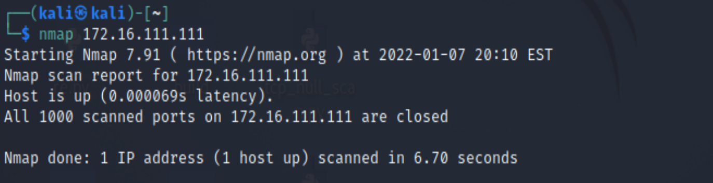
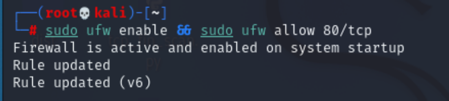
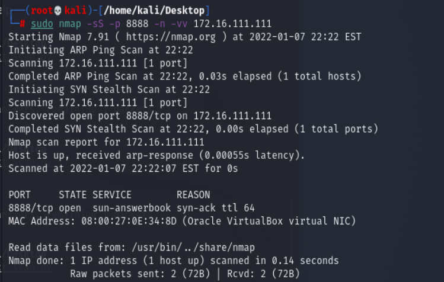
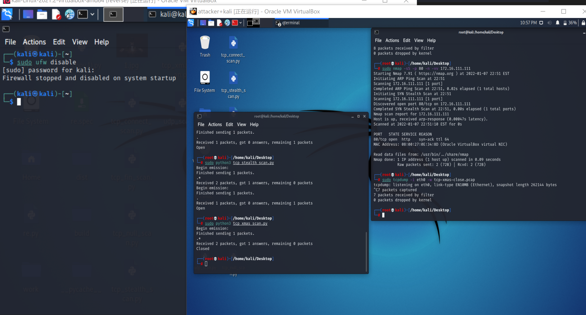
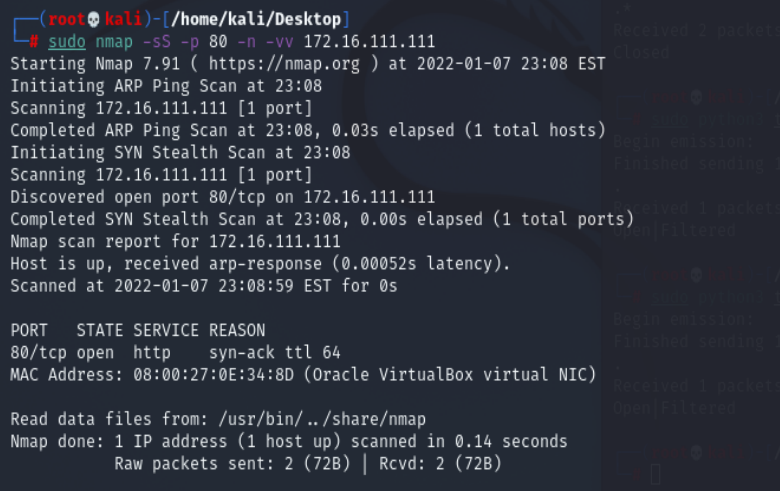
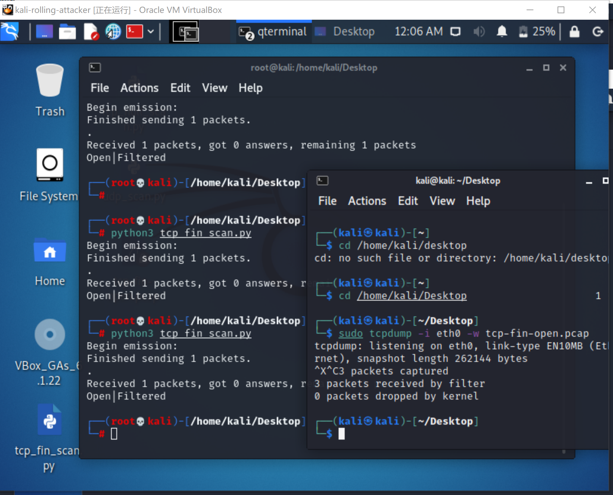

# 实验五：基于 Scapy 编写端口扫描器

## 实验目的

- 掌握网络扫描之端口状态探测的基本原理

## 实验环境

- python 3.8.0
- nmap 7.91
- Scapy 2.4.4
- Linux kali 5.7.0-kali1-amd64

## 实验要求(完成度)

- [x] TCP connect scan / TCP stealth scan
- [x] TCP Xmas scan / TCP fin scan / TCP null scan
- [x] UDP scan
- [x] 上述每种扫描技术的实现测试均需要测试端口状态为：`开放`、`关闭` 和 `过滤` 状态时的程序执行结果
- [x] 提供每一次扫描测试的抓包结果并分析与课本中的扫描方法原理是否相符？如果不同，试分析原因；
- [x] 在实验报告中详细说明实验网络环境拓扑、被测试 IP 的端口状态是如何模拟的
- [x] 复刻 `nmap` 的上述扫描技术实现的命令行参数开关
- [ ] 

## 实验过程

#### 网络拓扑


#### 端口状态模拟

- **关闭状态**：对应端口没有开启监听, 防火墙没有开启。
  ```bash
  ufw disable
  ```
- **开启状态**：对应端口开启监听: apache2基于TCP, 在80端口提供服务; DNS服务基于UDP,在53端口提供服务。防火墙处于关闭状态。
  ```bash
  systemctl start apache2 # port 80
  systemctl start dnsmasq # port 53
  ```
- **过滤状态**：对应端口开启监听, 防火墙开启。
  ```bash
  ufw enable && ufw deny 80/tcp
  ufw enable && ufw deny 53/udp
  ```


初始状态：



#### TCP connect scan

[code](code/tcp_connect_scan.py)

- Closed
  
  
  
在抓包结果中被攻击者发送了RST/ACK数据包，说明端口关闭

  

- Filtered
  
  
  
靶机只收到了一个TCP包且没有响应，说明靶机端口处于过滤或开启状态，与预期相符合

  

- Open

  
  
  


#### TCP stealth scan

[Code](code/tcp_stealth_scan.py)

- Closed
  
  
  
  

- Open

  
  
  

- Filtered
  
  
  
  

#### TCP Xmas scan

[Code](code/tcp_xmas_scan.py)

- Closed
  
  
  
在抓包结果中victim发送了RST/ACK数据包，说明端口关闭
  

- filtered

  
  
  
victim只收到了一个TCP包且没有响应，说明靶机端口处于过滤或开启状态，与预期相符合
  

- open
  
  
  
victim只收到了一个TCP包且没有响应，说明靶机端口处于过滤或开启状态，与预期相符合

  

#### TCP fin scan
[Code](code/tcp_fin_scan.py)

- Closed
  
  
在抓包结果中victim发送了RST/ACK数据包，说明端口关闭
  

- Filtered
  
  
victim只收到了一个TCP包且没有响应，说明靶机端口处于过滤或开启状态，与预期相符合
  

- Open

（做到这里的时候，attacker+kali突然黑屏，尝试了网上的改错方法或者重启都没能拯救过来，只能进行命令行操作，进不去图形化界面，所以我又速速装了一个，名为kali-rolling-attacker,172.16.111.150）

  
  
victim只收到了一个TCP包且没有响应，说明靶机端口处于过滤或开启状态，与预期相符合

### nmap:
  


#### TCP null scan
[Code](code/tcp_null_scan.py)
- Closed
  
  
在抓包结果中victim发送了RST/ACK数据包，说明端口关闭
  

- Open

  
victim只收到了一个TCP包且没有响应，说明靶机端口处于过滤或开启状态，与预期相符合
  

- Filtered
  
  
victim只收到了一个TCP包且没有响应，说明靶机端口处于过滤或开启状态，与预期相符合
  


#### UDP scan
[Code](code/udp_scan.py)

- Closed
  
  
  

victim收到了来自attacker的UDP数据包，并且发送了ICMP端口不可达的数据包，在ICMP数据中Type和code均为3，说明端口关闭，符合预期结果

- Filtered
  
  
  
在victim中收到了来自attcker的UDP数据包，但没有做任何响应，说明端口处于过滤状态==或开启状态==，与预期相符合
  

- Open

  
  
victim接收到了attcker发送的UDP数据包，并发送了响应包，说明端口开启，与预期相符合


### 参考

- [scapy2.4.4文档](https://scapy.readthedocs.io/en/latest/)
- [Port Scanning Using Scapy](https://resources.infosecinstitute.com/port-scanning-using-scapy/)
- [python_scapy实现TCP端口扫描](https://blog.csdn.net/rootkitylp/article/details/53174110)
- [Linux kali开启端口、关闭防火墙方法](https://blog.csdn.net/qq_42103479/article/details/90111365)